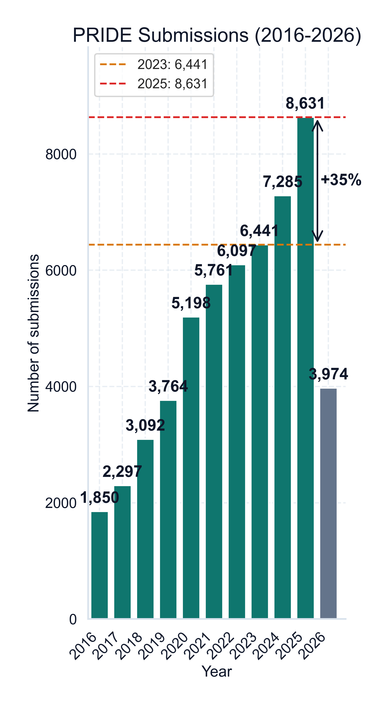
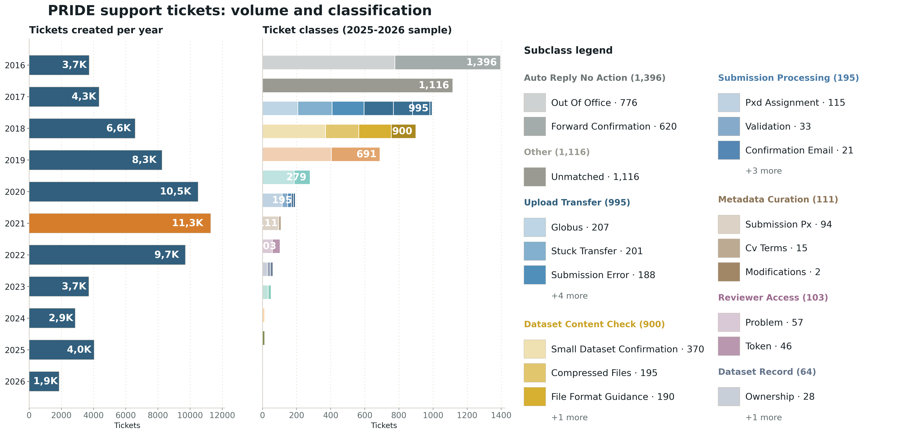
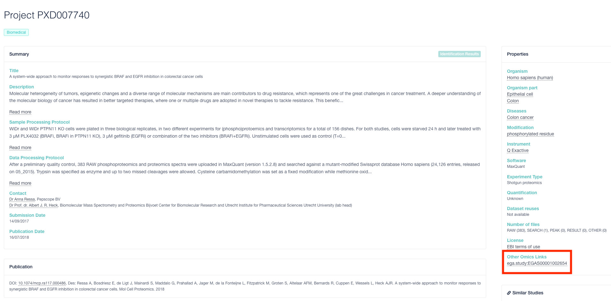

<!-- _class: lead -->

# Towards an **Agentic** Proteomics Archive

### The AI engineering behind PRIDE 2026

**Selva** · AI Engineer, PRIDE Archive — EMBL-EBI

<!--
Opening line: "PRIDE's direction for 2026 is an agentic Archive — one that curates, answers, and connects itself with far less manual effort. I want to walk you through the AI systems I've built that already make that real, and where I'd take them next."
This is the thesis: not a vision deck — a "what I shipped and what's next" deck.
-->

---

## Why PRIDE needs an AI layer — the scale is real



- **58,000** total datasets
- **8,631** submissions in **2025** — **+35%** vs 2023
- **~746** submissions / month (2025)
- Large: 44 → **109** over 1 TB · 3 → **11** over 4 TB
- Storage ~**4 PB**

A small team. **~60% of submitters are first-timers** every year. The volume of **submissions, curation, and helpdesk** grows faster than the people who handle it.

<!--
Land the gap: growth is in both volume and complexity (bigger files, new labs every year). You can't hire your way out of ~746 submissions/month with a part-time support rota. The lever is automation — AI that handles the routine and escalates only what needs a human.
Note: 8,631 is the 2025 full-year figure; the 2026 bar (grey) is year-to-date. Verify all figures against the latest stats before presenting.
-->

---

## PRIDE's strategy: remove the human bottlenecks

Four design principles drive the Archive — three of them are **AI problems**:

- **Fast in & out** — submission and download stay fast.
- **Increase findability** — better search & recommendations. *(AI)*
- **Infrastructure reuse** — more functionality, less code & fewer services.
- **Reduce human helpdesk** — less manual intervention in submission & support. *(AI)*

> The 2026 goal is an **agentic Archive**: agents in production that *heal* metadata and answer users — keeping a human in the loop only when it matters.

<!--
This connects your work to the team's stated strategy. You're not freelancing on AI for its own sake — every system you built maps onto a principle the Archive already committed to. Set up the next four slides: "Here's what I shipped against these principles."
-->

---

## What I built #1 — the PRIDE Chatbot (DocBot)

**A RAG assistant over PRIDE's documentation** — answers user & curator questions in natural language.

- **Architecture:** docs → cleaned text chunks → sentence-transformer embeddings → **Vector DB**; retrieval + **LLM (Gemini)** completion with a controlled prompt template.
- **Started end 2023.** Now graduated into an **EBI-wide service** ("DocBot"), run with Henning's team.

**Impact:** deflects repetitive documentation questions before they ever become a ticket.

<span class="small">Bai, **Kamatchinathan**, Kundu, Bandla, Vizcaíno, Perez-Riverol. *Open-source large language models in action: A bioinformatics chatbot for the PRIDE database.* Proteomics 2024 — PMID 38556628.</span>

<!--
This is your flagship. You're a co-author on the paper — say so. It proves the work is published and peer-reviewed, not internal-only. Emphasize two things: (1) you took it from prototype (end 2023) to a production service adopted beyond PRIDE — that's real engineering maturity, not a demo; (2) the architecture is textbook-correct RAG (chunking, embeddings, retrieval, grounded generation) so you can go deep if they probe.
-->

---

## What I built #2 — the RT-AI helpdesk agent (2026)

**An agent on the support queue (RT)** that reads tickets and acts.

- **Local LLM anonymizes** each ticket first → privacy-safe before any external call.
- **Gemini classifies & prompts an action:** auto-reply, "make dataset public" requests, account issues, spam removal — or *defer to a human* when the answer isn't clear.
- Customizable per **prompt / action / context**.

**Impact:** with only part-time human support, it absorbs auto-replies and routine tickets — **excellent during infrastructure incidents** (e.g. Aspera issues).

<!--
The privacy-first design (local model anonymizes before the cloud LLM sees anything) is a strong point with an EBI/data-governance panel — flag it deliberately. Be honest about limits: it still needs refinement on local/environment-specific errors and a more agentic interface. Showing you know the gaps builds credibility.
-->

---

## The helpdesk reality RT-AI tackles



**Auto-replies (1,396) and routine classes dominate the queue** — confirmations, transfer issues, content checks. These are exactly the tickets the agent resolves or defers, freeing the human for the rest.

<!--
This is the empirical backbone of the helpdesk argument. Walk left-to-right: ticket volume per year (left), then the class breakdown (right). Point at "Auto Reply No Action — 1,396": that whole bar is pure automation headroom. The story writes itself — the bottleneck is real, measured, and mostly routine.
-->

---

## What I built #3 — LLM-guided cross-references

**Automatically links PRIDE datasets to the wider data ecosystem.**

- Mines **PubMed / DOI + manuscript content**, plus regex for known repositories.
- Connects to **GEO, BioProject, SRA, ArrayExpress, MetaboLights, EGA, ENA, BioSamples, IntAct**.
- **LLM-based validation** confirms a dataset is genuinely cross-referenced (vs. a stray mention).

**Scale:** thousands of automated links — e.g. **~4,250 GEO** and **~1,400 BioProject** cross-references — replacing manual annotation.

<!--
This is the "data integration" half of PRIDE's mission made automatic. Frame it as turning PRIDE from an island into a hub. The LLM-validation step is the clever bit: regex finds candidates, the LLM filters false positives — precision matters because wrong cross-references pollute downstream resources.
-->

---

## Cross-references, live in the PRIDE web



PXD007740 — the **"Other Omics Links"** panel surfaces an automatically linked **EGA study**, right on the dataset page.

<!--
Concrete payoff slide: the pipeline isn't a backend abstraction, it shows up where users actually look. Point at the highlighted "Other Omics Links" box. One real example beats any architecture diagram for making the feature tangible.
-->

---

## What I built #4 — agentic healing, validation & outreach

<div class="pillar">

**Agentic metadata "healing"** — agents in production that detect and repair metadata/data issues in submissions, contributing to validation dropping **34 h → 4 min**.

</div>
<div class="pillar">

**BlueSky bot** — an LLM service that writes clean dataset announcements; deliberately rate-limited (6 posts/day) — measurable rise in engagement.

</div>
<div class="pillar">

**Data-reuse insight** — a semi-supervised, LLM-based framework to quantify PRIDE data reuse from download statistics *(bioRxiv 2026)*.

</div>

<!--
These show range: ingestion (healing), dissemination (BlueSky), and analytics (reuse framework). Don't dwell — one sentence each. The point is breadth: you've applied AI across the whole data lifecycle, not just one corner.
-->

---

## The big picture — one AI layer, not scattered tools

```
   Submitters · Curators · Users · Agents
                  │
   ┌──────────────────────────────────────┐
   │              AI LAYER                  │
   │  DocBot (RAG)   ·   RT-AI agent        │
   │  LLM cross-refs ·   metadata healing   │
   │  BlueSky bot    ·   reuse analytics    │
   └──────────────────────────────────────┘
                  │  (same PRIDE APIs)
   Kubernetes · MongoDB · Elasticsearch · FIRE/S3 · Slurm
```

Each is an **independently deployable service** on the existing stack — together they make PRIDE **answer, curate, and connect itself**.

<!--
Tie it together: individually these are features; collectively they're the agentic Archive. Stress the architectural discipline — every AI service speaks through the same APIs and scales like the rest of the platform. No moonshot rewrite, contained risk.
-->

---

## Where I take it next

- **Semantic & agentic discovery** — search by *biology*, not filenames; expose the Archive to agents (MCP) so tools query PRIDE directly.
- **A more agentic helpdesk** — RT-AI that resolves end-to-end, understands local/environment-specific errors.
- **Healing everywhere** — generalize metadata repair across all 58k datasets, not just new submissions.
- **Reuse-driven curation** — let the reuse signal prioritize what gets enriched and reprocessed.

<!--
Forward-looking but anchored — each item is the natural next step of a system already running, so it reads as a roadmap, not a wishlist. MCP is worth naming: it's the concrete bridge from "chatbot" to "agentic archive."
-->

---

## Why me

I'm the engineer who has **already shipped the AI layer of an agentic Archive into production** — from prototype to EBI-wide service.

- **Production AI, not demos:** DocBot, RT-AI, and LLM cross-references run live against real submissions and users.
- **Full lifecycle:** ingestion (healing), support (RT-AI), discovery (RAG), integration (cross-refs), outreach (BlueSky).
- **Right architecture:** RAG done properly, privacy-first (local anonymization), services that scale on the existing stack.
- _[Placeholder — add Selva's background: ML/NLP experience, education, key prior projects]_

<!--
Your differentiator is that the "vision" is your track record. Close the loop: every claim here points back to a slide you just showed. Fill the placeholder with 1-2 quantified background facts before the interview.
-->

---

<!-- _class: lead -->

# PRIDE made proteomics data **open**.

# I'm building the layer that makes it **agentic**.

### Thank you — questions?

<span class="small">Selva · AI Engineer · PRIDE / EMBL-EBI</span>

<!--
Deliver the two lines slowly. Then open for questions — be ready to go deep on DocBot architecture, the RT-AI privacy design, or the cross-reference validation, since those are the most probe-worthy.
-->
